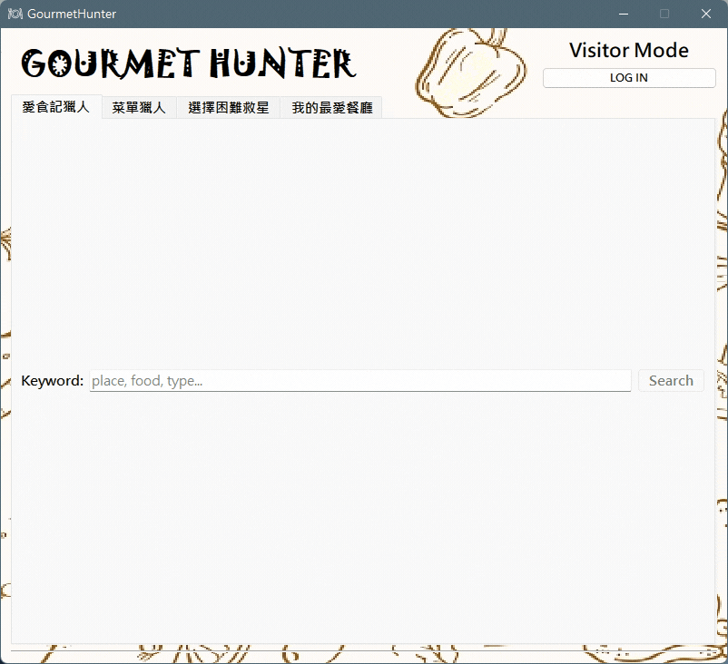
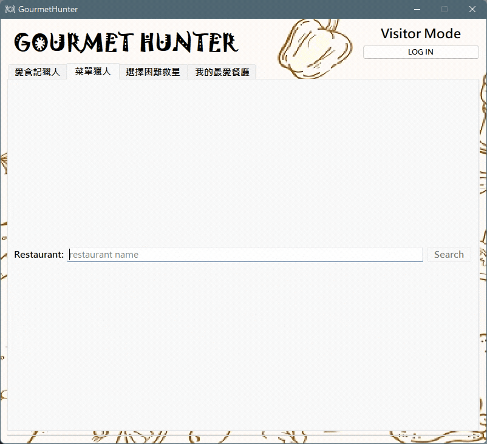
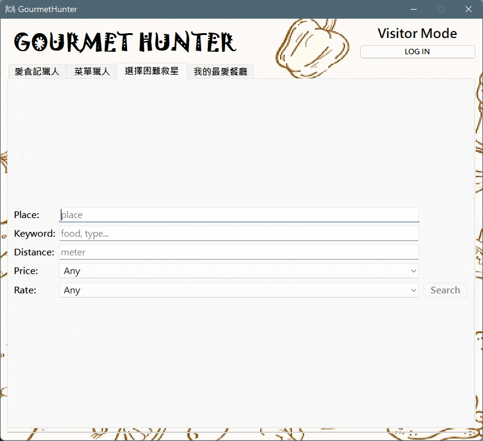
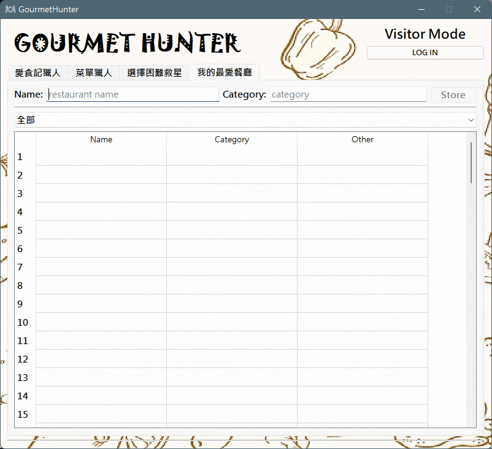

<h1 align="center"><b>GourmetHunter</b></h1>

# **Description**
Gourmet Hunter is a mutifunctional application coded in Python. It is designed to fulfill our daily needs in "hunting gourmet." To be specific, it contains mainly four function in our design and three core fields in extensive Python usage, **web crawler**, **data processing** and **GUI design** respectively. 

Our team tried hard to learn numbers of modules and packages in the class and on the Internet to implement various function setup in the codes.

# **What It Is and How To Use**
## **Open the `GourmetHunter.py`**
## **愛食記獵人**
> Crawl articles on the blog [Ifoodie](https://ifoodie.tw/).


### **Type and Search**
* **Type** any keyword in the lineedit.
* **Search** by just click the search button.
### **Click and Read**
* **Click** the links to read the articles on your default browser.
* **Read** the articles and choose one gourmet to give it a try!

## **菜單獵人**
> Crawl and capture menu picture of specific restaurant.


### **Type and Search**
* **Type** the nme of restaurant in the lineedit.
* **Search** by just click the search button.
### **Find and Go**
* **Find** the meals you are interested in.
* **Go** having the gourmet in any unfamiliar restaurant.

## **選擇困難救星**
> Crawl data on [GoogleMap](https://www.google.com.tw/maps/) to select a satifying restaurant.


### **Type and Select**
* **Type** the place(necessary), keywords(optional), distance(optional, in meter) in the lineedit respectively.
* **Select** the degree of price(Low to High) and rating(one to five star).
### **Search and Enjoy**
* **Search** by just click the search button.
* **Enjoy** the gourmet free from suffering *Decidophobia*.

## **我的最愛餐廳**
> Stoage restauants and their categories in .csv file and add a filter to them with any existing category.


### **Type and Store**
* **Type** the restaurant and its category/categories(seperate by "," or ", ").
* **Store** the data in the user's unique .csv file by click the store button.
### **Filter and Choose**
* **Filter** the data by selecting the drop-down menu.
* **Choose** one restaurant that satisfy your needs in gourmet to revisit it.

## Bonus! - **User System**
> Change your login between visitor mode or other users to generate different database of "Your Favorite."
### **Just Log IN**
* **Log in** with any other users' names or switch to visitor mode just click the top-right button.

# **About Project**
## **Web Crawler**
* `request` is used to get information of website, and use `beautifulsoup` to process the source data.
* Write `selenium` scripts to find out targes step by step, and use `cv2` to make some basic processing on picture data.
* use `googlemaps` to acquire eligible data and import `pandas` to process data.
## **Data Processing**
* `beautifulsoup`, `cv2`, `pandas`, and `csv` are used to process different raw data with various algorithm, in order to have us make good use of them.
## **GUI Design**
* `PyQt5` is used to construct all our GUI.
* We choose the `QTabWidget` to construct tab interface to make four subwindows in the main window of application.

# **Others**
## **Project Setup**
### **Package**
```powershell
pip install pyqt5
pip install bs4
pip install googlemaps
pip install numpy
pip install opencv-python
pip install pandas
pip install requests
pip install selenium
```
or download the [requirements.txt](./requirements.txt)
```powershell
pip -r requirements.txt
```
### **ChromeDriver**
The program needs different version of ChromeDriver under different user system, and our project sets `ChromeDriver97.0.4692.71` as default. Check your Chrome version on [Chrome setting](chrome://settings/help). If needed, downloed ChromeDriver [here](https://chromedriver.chromium.org/downloads) and store the .exe under root directory.

## **Future Scope**
* Improve system fluency.
* Import image identification to improve accuracyof output.
## **Reference Data**
* [Google maps platform | Google developer](https://developers.google.com/maps/documentation)
* [googlemaps Module document](https://googlemaps.github.io/google-maps-services-python/docs/index.html)
* [googlemaps on pip](https://pypi.org/project/googlemaps/)